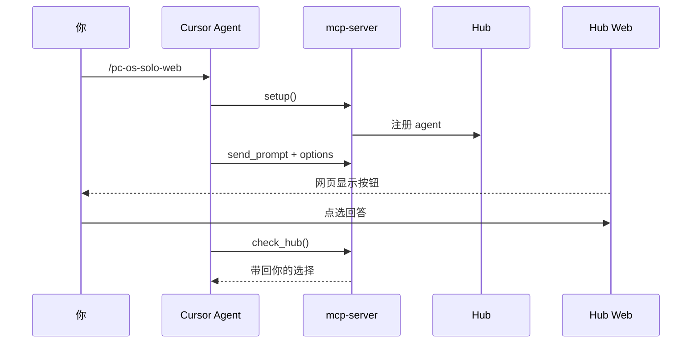

# PolarCopilot（开源版）


*上图：长时间用 **Solo Web + YOLO** 驱动 Agent 连续跑任务时，Cursor **Included Usage** 的典型「超额」账单效果（示例数据，仅供感受规模）。*

---

**一个 Cursor 对话 + 一个 Hub 网页。** Agent 通过 MCP 连本地 Hub；你在浏览器里点选回复、做 YOLO 对齐。

> **本文档是唯一入口。** 先看 **「给人看的操作清单」**；装环境时对 Agent 说 **「按照 README 完成部署」**，Agent 按 **「给 Agent 的执行清单」** 操作。  
> 截图在 **`docs/images/`**，下文用 Markdown 标准语法引用；请用 Cursor **打开本仓库根目录** 预览，才能看到图。

---

## 给人看的操作清单

按**时间顺序**执行。带 **【你亲手】** 的步骤 Agent 无法代替。

| 顺序 | 谁来做 | 做什么 |
|:----:|:------:|--------|
| **1** | **【你亲手】** | 用 Cursor **打开本仓库根目录**（能看到 `hub/`、`web/`、`README.md`、`docs/images/`）。 |
| **2** | 你 → Agent | 对话发送：**「按照 README 完成部署」** 或 `/pc-os-start`，等 Agent 完成安装、构建、写配置、启动 Hub。 |
| **3** | **【你亲手】** | **Settings → MCP** → 打开 **`hub-agent-1`**（或 `project-…-hub-agent-1`）→ **Reload MCP**，直到无报错。 |
| **4** | 你 | 浏览器打开 **http://127.0.0.1:8040/**，确认只有 **Agent 控制**、**YOLO** 两个页签。 |
| **5** | 你 | 对话发送 **`/pc-os-solo-web`**，进入网页控制循环。 |
| **6** | **【你亲手】** | 之后 Agent 在网页提问时，**在 Hub 网页点选项**回复（不要只在 Cursor 里打字）。 |

### 只有你能做的两件事

1. **Cursor 里打开 MCP 并 Reload**（第 3 步）  
2. **在 Hub 网页上点选回复**（第 6 步）——Solo Web 以网页按钮为输入源

### 自己敲命令（不用 Agent）

```bash
cd /你的路径/PolarCopilot_Opensource
npm run setup
bash scripts/start-hub.sh
curl -s http://127.0.0.1:8040/api/ui/health   # 应含 "ok"
```

然后仍须完成上表 **第 3～6 步**。

---

## 给 Agent 的执行清单

**触发词**：「按照 README 完成部署」「按 README 装好」、`/pc-os-start`

| 步骤 | 动作 | 说明 |
|:----:|------|------|
| A1 | 检查环境 | `node -v`（建议 ≥ 22）、`npm -v` |
| A2 | 安装与构建 | `npm run install:all` → `npm run build:web`，或 `npm run setup` |
| A3 | 写 MCP 配置 | `bash scripts/setup-mcp.sh` |
| A4 | **暂停** | 提醒用户完成 **操作清单第 3 步**（MCP 开关 + Reload） |
| A5 | 启动 Hub | `bash scripts/start-hub.sh` |
| A6 | 自检 | `curl …/api/ui/health` 为 ok；失败看 `/tmp/pc-os-hub.log` |
| A7 | **收尾** | 请用户打开浏览器、`/pc-os-solo-web`，并说明在网页点选项 |
| A8 | 可选 | `bash scripts/e2e-smoke.sh` 冒烟；`bash scripts/sync-skills.sh` |

**禁止**：替用户点 MCP 设置；Solo Web 下用 AskQuestion 代替网页按钮。

---

## 完整上手指南

### 1. 项目在做什么

| 角色 | 做什么 |
|------|--------|
| **你** | 在 Cursor 里下指令；在 **Hub 网页**上点按钮作答 |
| **Cursor Agent** | 通过 MCP 向 Hub **发 prompt（带选项）**，并 **check_hub** 等你点完 |
| **Hub** | 本地 HTTP（默认 **8040**）：存会话、待答、YOLO 对齐文档 |
| **Web** | **Agent 控制** + **YOLO** 两个页签 |

多 Agent 时没有左侧 Agent 列表；每条问题卡片上的**标签**即 Agent 名称（`send_prompt` 的 `display_name` 或 `patch_agent`）。

### 2. 每次启动用什么（固定参数）

**每次新开 Cursor 会话或重启电脑后，按此顺序：**

| 次序 | 做什么 | 用什么 |
|:----:|--------|--------|
| 1 | 启动 Hub | `bash scripts/start-hub.sh` → 默认 **http://127.0.0.1:8040/** |
| 2 | 确认 MCP 已开 | Cursor **Settings → MCP** → **`hub-agent-1`** 为 ON → **Reload** |
| 3 | 打开网页 | **Agent 控制**：http://127.0.0.1:8040/pc/prompts ；**YOLO**：http://127.0.0.1:8040/pc/yolo |
| 4 | 进入循环 | Cursor 发送 **`/pc-os-solo-web`** |
| 5 | Agent 连 Hub | MCP **`setup`**（每个 Cursor 会话一次；Hub 重启后必须重做） |

**端口与 MCP（`.cursor/mcp.json`，由 `scripts/setup-mcp.sh` 生成）：**

| 项 | 值 | 含义 |
|----|-----|------|
| MCP 服务名 | `hub-agent-1` | 第一个 Cursor 对话绑定这个 |
| `HUB_PORT` | `8040` | 与 Hub 监听端口一致 |
| `HUB_SESSION` | `1` | 槽位 1；第二个对话用 `hub-agent-2` + `HUB_SESSION=2` |
| `PC_PROJECT_DIR` | 本仓库绝对路径 | MCP 发现 Hub、注册项目 |

改端口：`PC_HUB_PORT=8041 bash scripts/start-hub.sh`，并改 `mcp.json` 里的 `HUB_PORT`。

### 3. 一次会话怎么跑



- `send_prompt` **必须带 options**；之后 **必须 check_hub**。
- 只在 Cursor 里打字**不算**回答。

### 4. Agent 控制页（日常指挥）


**图中是什么**

- 顶栏 **Agent 控制 | YOLO**：日常问答用前者；极限目标对齐用后者。
- **待回答**：Agent 通过 MCP `send_prompt` 推来的问题；数字为条数。
- **卡片标签**（如 `文档演示:Agent控制`）：Agent 显示名；多对话时靠它区分（无左侧 Agent 栏）。
- **选项按钮**：`send_prompt` 里的 `options`；可多选 + 底部文字，**⌘+Enter 发送**。
- **History**（右侧）：已回答记录；拖拽竖线可调宽度。

**你怎么操作**

1. 已完成 `/pc-os-solo-web`，且 Agent 跑过 **`setup`**。
2. Agent `send_prompt` 后，**只在本页点按钮或发送**。
3. Agent 会 `check_hub` 阻塞到你点完。

---

### 5. 多 Agent 时如何区分


**含义**：每个 Cursor 窗口对应一个 `hub-agent-N`。发问时带上名称，例如 MCP：

`send_prompt(..., display_name="前端:登录页")`

名称会显示在问题卡片左上角，无需维护 Agent 列表。

---

### 6. YOLO 怎么用

**流程（全自动前必须先对齐）：**

| 步骤 | 谁 | 做什么 |
|:----:|-----|--------|
| 1 | Agent | `pc-os-yolo-confirm`：写极限目标 + 7 段对齐文档 |
| 2 | 你 | 打开 **YOLO** 页，审阅、修改、逐段确认 |
| 3 | 你 | 点 **批准 / 开始执行** |
| 4 | Agent | `pc-os-yolo-execute`：按对齐文档实施；进度仍通过 **Agent 控制** 页 `send_prompt` 汇报 |


**图中是什么**

- 页顶可输入**极限目标**（需有在线 Agent 时由 Hub 转发给 Agent）。
- **Pending**：待你审批的对齐稿。
- **History**：已批准或已完成的对齐记录。

**注意**：YOLO 不负责日常问答；执行阶段的请示仍出现在 **Agent 控制** 页。

---

### 7. MCP 工具

| 工具 | 何时 | 作用 |
|------|------|------|
| `setup` | 每会话开始 / Hub 重启后 | 连 Hub、注册 `agent_id` |
| `send_prompt` | 要问用户 | 问题 + **options**；可选 **display_name** |
| `check_hub` | 每次 `send_prompt` 后 | 等网页作答 |
| `patch_agent` | 改名 | 更新显示名 |
| `hub_status` | 排错 | 端口、`agent_id` |

### 8. 验收与命令

```bash
bash scripts/e2e-smoke.sh           # API 冒烟
bash scripts/capture-screenshots.sh # 重新截取 docs/images 里的图
```

| 目的 | 命令 |
|------|------|
| 首次安装 | `npm run setup` |
| 启动 Hub | `bash scripts/start-hub.sh` |
| 停止 Hub | `tmux kill-session -t pc-os-hub` |

---

## 你会得到什么

| 组件 | 目录 | 作用 |
|------|------|------|
| **Hub** | `hub/` | 本地 HTTP + SQLite |
| **Web** | `web/` | Agent 控制 + YOLO |
| **MCP** | `mcp-server/` | Cursor 桥 |

历史栏拖拽：[docs/HISTORY_PANEL.md](docs/HISTORY_PANEL.md)

---

## 前置条件

Node.js（建议 ≥22）、npm、Cursor；可选 tmux。

---

## 架构

```
你（浏览器） ←→ Hub Web（/pc/prompts、/pc/yolo）
                    ↑
Cursor Agent ←MCP→ mcp-server ←HTTP→ hub :8040
```

---

## Skills（`pc-os-*`）

| Skill | 用途 |
|-------|------|
| `pc-os-start` | 按 README 部署 |
| `pc-os-solo-web` | 网页控制循环 |
| `pc-os-yolo-confirm` | 写对齐文档 |
| `pc-os-yolo-execute` | 审批后实施 |

---

## 环境变量

| 变量 | 默认 |
|------|------|
| `PC_HUB_PORT` | `8040` |
| `PC_PROJECT_DIR` | 仓库根 |
| `HUB_SESSION` | `1` |

---

## 常见问题

### 预览里图不显示（Cursor 特有）

**不是你的 Markdown 写错了。** 标准写法 `` 在 GitHub、Typora、VS Code 侧栏预览里都能显示。

Cursor 右上角 **Preview / Markdown 切换按钮** 用的是**另一套渲染器**，目前**不渲染本地图片**（社区已知问题）。你可以：

| 方式 | 操作 | 是否显示本地图 |
|------|------|----------------|
| **推荐** | `Cmd+Shift+V`（**Open Preview to the Side**） | ✓ |
| **推荐** | 用 **Open Folder** 打开本仓库根目录；项目已含 `.vscode/settings.json` 默认用 VS Code 预览器打开 `.md` | ✓ |
| 不推荐 | 编辑器右上角 **Preview** 切换 | ✗（本地图常空白） |

另请确认：打开的是 **本仓库根目录**（与 `docs/images` 同级），不要只打开上级文件夹，否则相对路径也解析不到。

**MCP 连不上** — Hub 是否启动；`HUB_PORT`、`PC_PROJECT_DIR` 是否正确。

**网页空白** — `npm run build:web` 后重启 Hub。

---

## 许可证

本项目采用 **[MIT License](LICENSE)**（允许商用，但必须署名）：

| 权利 | 说明 |
|------|------|
| **商用** | 可用于个人或商业产品，无需另行授权 |
| **署名** | 再分发、修改或嵌入时，须在副本中保留**版权声明**与 **MIT 许可全文** |
| **无担保** | 软件按「原样」提供，作者不承担法律责任 |

Copyright © 2026 [beichenO2](https://github.com/beichenO2)
